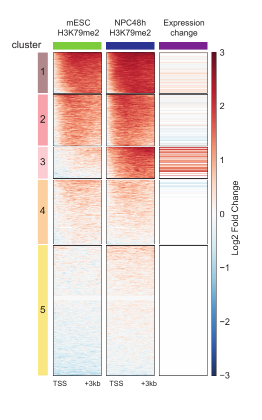

# ultraheatmap

ultraheatmap facilitates the production of [deepTools](https://github.com/deeptools/deepTools)
heatmaps. The heatmaps typically show signal at genomic regions, which can be
appended by orthogonal data, like associated gene expression. ultraheatmap
facilitates adding orthogonal data to a deepTools matrix and allows to cluster a
genomic heatmap by selected samples in just one single command-line call.

  

This figure has been generated by the ultraheatmap on real data. The first two columns show the ChIPs signal while the last column shows the gene expression of the closest gene to each region of any cluster.

## Getting Started

These instructions will get you a copy of ultraheatmap up and running on your local machine.

### Prerequisites

The Prerequisites can be found in requirements.yaml

### Installation

First, get the source code:

             $  git clone https://github.com/maxplanck-ie/ultraheatmap.git

Afterwards, create a new conda environment with all the Prerequisites by running the following command line:

              $ conda env create -f requirements.yaml

Then activate the environment:

              $ conda activate ultraheatmap

To install the program in this environment:

              $ python setup.py install

from the ultraheatmap directory.

Alternatively, `pip` or `conda` can be used to install the package. We highly
recommend you to create a new conda environment prior to the installation and
install it after activating this environment. This can be done as follows:

              $ conda create -n ultraheatmap python=3.6

              $ conda activate ultraheatmap

              $ conda install -c bioconda -c conda-forge ultraheatmap

Now, you already have the program installed and can access each of the modules by calling them. Try

              $  ultraheatmap -h ,

              $  computeOrderedMatrix -h

or

              $  addFeatureToMatrix -h

              $ conda deactivate

### Usage example
              $ computeOrderedMatrix -h

              usage: computeOrderedMatrix [-h] -S BIGWIGS [BIGWIGS ...] -R REGIONOFINTEREST
              [REGIONOFINTEREST ...] -o MATRIXOUTPUT
              [-g REFINDICES [REFINDICES ...]]
              [-p NUMBEROFPROCESSORS [NUMBEROFPROCESSORS ...]]
              [--outFileSortedRegions OUTFILESORTEDREGIONS]
              [--outputReferenceMatrix OUTPUTREFERENCEMATRIX]
              [--kmeans INT] [--hclust INT]
              [-b BEFOREREGIONSTARTLENGTH [BEFOREREGIONSTARTLENGTH ...]]
              [-a AFTERREGIONSTARTLENGTH [AFTERREGIONSTARTLENGTH ...]]
              [-op PLOTOUTPUT] [--config USERCONFIG]

              The program sorts/clusters regions considering the reference samples ( given
              by --groupUsingSamples) and makes a matrix over all the samples using the
              sorted/clustered regions.

              optional arguments:
                -h, --help            show this help message and exit

              required arguments:

                -S BIGWIGS [BIGWIGS ...], --scoreFileName BIGWIGS [BIGWIGS ...]
                bigwig files, the ordered matrix is computedfrom.
                (default: None)

                -R REGIONOFINTEREST [REGIONOFINTEREST ...],
                --regionsFileName REGIONOFINTEREST  [REGIONOFINTEREST ...]
                BED files definig the genomic regions of the
                matrix.Multiple files can be provided, but the per
                group information will be lost due to the clustering
                (default: None)

                -o MATRIXOUTPUT, --outFileName MATRIXOUTPUT
                Matrix clustered by the given reference samples
                (default: None)

             optional arguments:

                -g REFINDICES [REFINDICES ...],
                --groupUsingSamples REFINDICES [REFINDICES ...]
                sample indices (order of the bigwig files given via -S).
                It is 1-based and is used to define the reference samples.
                The reference samples will be used for sorting/clustering the
                regions (given bed files), before all samples will be used to
                generate the output matrix. Several indices can be added while
                separated by space from each other. Default is None and will
                take all the samples into account to sort/cluster the regions.
                (default: None)

                -p NUMBEROFPROCESSORS [NUMBEROFPROCESSORS ...],
                --numberOfProcessors  NUMBEROFPROCESSORS [NUMBEROFPROCESSORS ...]
                From deepTools doc: Number of processors to use. Type
                "max/2" to use half the maximum number of processors
                or "max" to use all available processors. (default:
                [1, 1])

                --outFileSortedRegions OUTFILESORTEDREGIONS
                From deepTools doc: File name in which the regions are
                saved after skiping zeros or min/max threshold values.
                The order of the regions in the file follows the
                sorting order selected. This is useful, for example,
                to generate other heatmaps keeping the sorting of the
                first heatmap. (default: None)

                --outputReferenceMatrix OUTPUTREFERENCEMATRIX
                Matrix on the reference sampels only before clustering
                (default: None)

                --kmeans INT number of clusters in k-means clustering (default: None)

                --hclust INT number of clusters to compute using
                hierarchicalclustering as defined by deepTools
                plotHeatmap (default: None)

                -b BEFOREREGIONSTARTLENGTH [BEFOREREGIONSTARTLENGTH ...],
                --upstream BEFOREREGIONSTARTLENGTH [BEFOREREGIONSTARTLENGTH ...],
                --beforeRegionStartLength BEFOREREGIONSTARTLENGTH [BEFOREREGIONSTARTLENGTH ...]
                From deepTools doc: Distance upstream of the start
                site of the regions defined in the region file. If the
                regions are genes, this would be the distance upstream
                of the transcription start site. (default: [0, 0])

                -a AFTERREGIONSTARTLENGTH [AFTERREGIONSTARTLENGTH ...],
                --downstream AFTERREGIONSTARTLENGTH [AFTERREGIONSTARTLENGTH ...],
                --afterRegionStartLength AFTERREGIONSTARTLENGTH [AFTERREGIONSTARTLENGTH ...]
                From deepTools doc: Distance downstream of the end
                site of the given regions. If the regions are genes,
                this would be the distance downstream of the
                transcription end site. (default: [0, 0])

                -op PLOTOUTPUT, --plotOutput PLOTOUTPUT
                File name to save the intermediate heatmap. The file
                ending will be used to determine the format of the
                image . Available formats are: "png", "eps", "pdf" and
                "svg" (From deeptools doc) (default: None)

                --config USERCONFIG   Added to the default configuration, overwrites if

example

              $ computeOrderedMatrix -S signal1.bw signal2.bw -R regions.bed \
              -o final_matrix.gz -p 20 -a 100 -b 100 --outputReferenceMatrix intermediate_matrix.gz \
              -op intermediate_matrix_heatmap.png -g 1 --kmeans 2

the above command line produces a `deeptools` matrix on both given `.bw` files while
the regions are the clusters obtained from the given `.bed` file after using `kmeans`
clustering algorithm with 2 clusters (`--kmeans 2`) based on the signal of first bigwig file (`-g 1`).

              $ addFeatureToMatrix -h
              usage: addFeatureToMatrix [-h] --matrix STR --output STR
              --feature.tables TABLES [TABLES ...]
              [--annotationFeature ANNOTATIONFEATURE]
              [--filteredGenomeGtfOutputFile ANNOTATIONOUTPUT]
              [--genomeGtf STR]
              [--featureNames FEATURES [FEATURES ...]]
              [--featureIdColumn IDCOLUMN]
              [--referencePoint REFERENCEPOINT]
              [--closestGenesOutput CLOSESTGENESOUTPUT]

              optional arguments:
                -h, --help            show this help message and exit

              required arguments:

                --matrix STR, -m STR  deeptools matrix (default: None)

                --output STR, -o STR  output matrix (default: None)

                --feature.tables TABLES [TABLES ...], -t TABLES [TABLES ...]
                gene id tables or name based tables, tables should be
                space-separated. (default: None)

              optional arguments:

                --annotationFeature ANNOTATIONFEATURE, -F ANNOTATIONFEATURE
                annotation file can be filtered by a feature such as
                gene, exon or transcript (default: None)

                --filteredGenomeGtfOutputFile ANNOTATIONOUTPUT, -oa ANNOTATIONOUTPUT
                saving filtered annotation file if --annotationFeature
                (default: None)

                --genomeGtf STR, -g STR
                genome annotation (gtf) to map peaks to closest gene.
                Will be filtered through '--annotationFeature'
                (default: None)

                --featureNames FEATURES [FEATURES ...], -f FEATURES [FEATURES ...]
                A list of features of interest from gene id tables or
                name based tables (default: ['log2(FC)'])

                --featureIdColumn IDCOLUMN
                name of the column includes ids/names (default:
                GeneID)

                --referencePoint REFERENCEPOINT
                If closest TSS or TES is needed, otherwise closest
                gene body will be found (default: None)

                --closestGenesOutput CLOSESTGENESOUTPUT, -og CLOSESTGENESOUTPUT
                A bed file to save the closest genes (default: None)

example

              $ addFeatureToMatrix -m  deeptools_matrix.gz -o appended_matrix.gz \
              -t feature_table.tsv -g annotaion.gtf -f column_of_interest_header \
              --featureIdColumn id_col_header

The above command adds extra columns to the input matrix. The output will be a matrix with
`deeptools` format which can be visualized by `deeptools plotHeatmap`. The extra columns could be gene expression. If annotation file is provided, program finds the closest gene for each region of the input matrix and looks for the gene expression of that gene from the given feature tables.
If no annotation file is given, program checks for the exact match between regions name from the input matrix and finds the same name on the given feature tables. The above image presents a matrix which has been generated by this module after mapping genes to peaks on real data.
